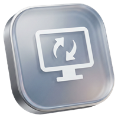



  
  <h1>DisplayMux</h1>
  

    <b>现代化的 Windows 显示器输入源切换工具</b>
  

  

    Designed by <b>ZEERDEER</b>
  

  
  

---

## 📖 简介 | Introduction

**DisplayMux** 是一个基于 WinUI 3 构建的轻量级 Windows 应用，旨在帮助用户快速管理和切换显示器的输入信号源。它利用 DDC/CI 协议，让你无需触碰显示器物理按键，即可在软件端轻松切换 HDMI、DisplayPort 等输入源。

## ✨ 功能特性 | Features

* **📺 信号接管**：支持通过 DDC/CI 协议直接控制显示器输入源。
* **🔌 多接口支持**：快速切换 DisplayPort、HDMI 1、HDMI 2 等常用接口。
* **🎨 现代设计**：采用最新的 Windows 11 Fluent Design 设计语言，支持 Mica（云母）材质与深色模式。
* **⚡ 丝滑动画**：内置流畅的列表进场动画与精致的 UI 交互。
* **🚀 轻量便携**：针对性能优化，极速启动。

## 🛠️ 技术栈 | Tech Stack

* **框架**：.NET 8, WinUI 3 (Windows App SDK)
* **语言**：C# / XAML
* **工具**：Visual Studio 2022

## 📦 下载与安装 | Download

> **🚀 点击这里下载最新版本：[Releases · ZEERDEER/DisplayMux](https://github.com/ZEERDEER/DisplayMux/releases)**

1.  点击上方链接进入 **Release** 页面。
2.  下载最新的 DisplayMux.exe (单文件版) 或 .msixbundle (安装版)。
3.  运行软件即可使用。

---

  Made with ❤️ by ZEERDEER

